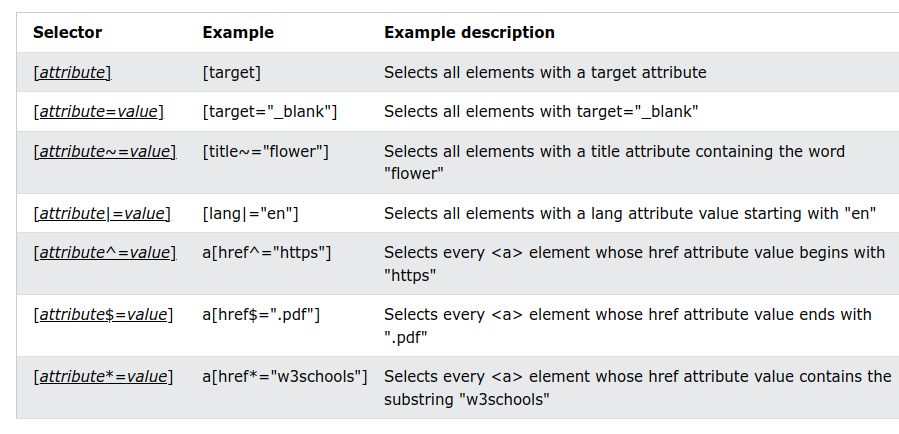
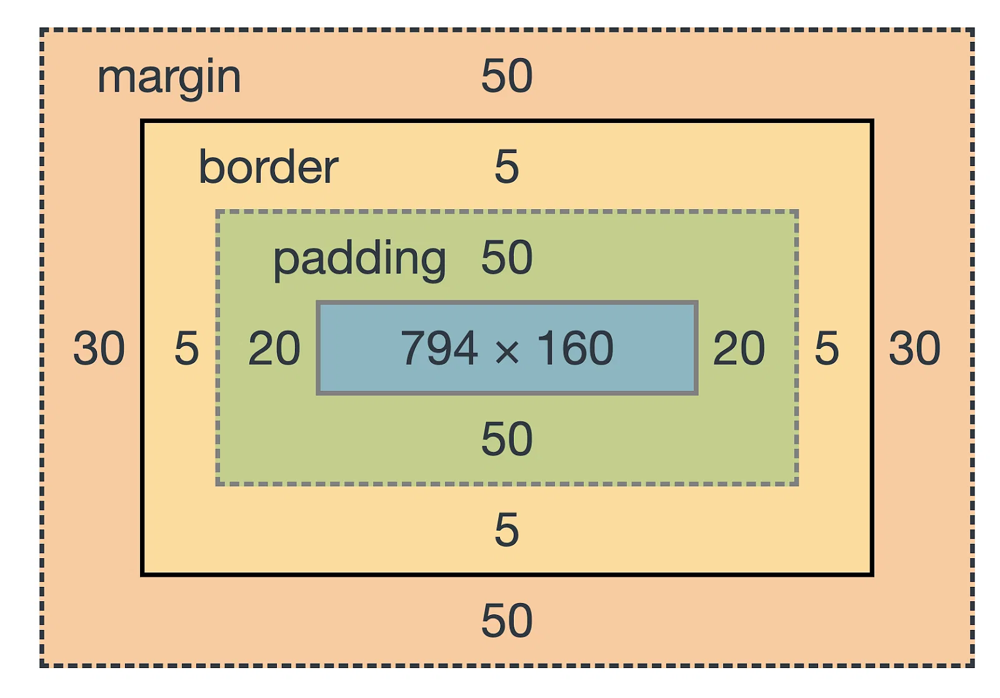

# CSS

## seletores

### simples

- seleciona elemento usando **nome da tag**, **id** (`#`) ou **classe** (`.`)

### combinadores

- seleciona elemento baseando-se no tipo de **relação** dele com outros elementos
- exemplos:
  - de **descendente** (` `) = o seletor combinador **mais usado**
    - `div.produto` vs `div .produto` = qual a diferença?
  - de **elemento filho** (`>`)
  - de **irmão adjacente** (`+`) = `div + p` seleciona `p` que está imediatamente após um elemento `div`
  - de **irmão em geral** (`~`) = `p ~ ul` seleciona `ul` somente se ele compartilhar de uma pai em comum com `p` e também for precedido por `p`

#### de descendente vs de elemento filho

```html
<style>
  .level-1 {
    background-color: red;
    height: 500px;
    width: 250px;
  }
  .level-2 {
    background-color: green;
    height: 150px;
    width: 150px;
    margin-bottom: 1rem;
  }
  .level-3 {
    background-color: blue;
    height: 50px;
    width: 50px;
  }

  /* .level-1 div {
    margin-left: 16px;
  }

  .level-1 > div {
    border: 3px solid black;
  } */
</style>
<body>
  <div class="level-1">
    <div class="level-2">
      <div class="level-3"></div>
    </div>
    <div class="level-2">
      <div class="level-3"></div>
    </div>
    <div class="level-2">
      <div class="level-3"></div>
    </div>
  </div>
</body>
```

#### de irmão adjacente vs de irmão geral

```html
<style>
  body {
    width: 500px;
  }

  /* h1 + p {
    color: red;
  }

  #h1-1 ~ p {
    text-decoration: underline;
  } */
</style>
<body>
  <p>Lorem ipsum dolor sit amet consectetur adipisicing elit. Corrupti obcaecati ab, veritatis quos maxime enim odit fugiat dicta minima repellendus doloremque dolores, nostrum aspernatur ipsum beatae qui harum neque dolorum?</p>
  <h1 id="h1-1">Inventore delorem</h1>
  <div>
    <p>Lorem ipsum dolor sit amet consectetur adipisicing elit. Quisquam quia atque adipisci expedita repellat eligendi nostrum rem, incidunt sint ut delectus omnis mollitia assumenda eos officiis, porro veniam dolores totam!</p>
  </div>
  <p>Nam facilis corporis ipsum molestiae dignissimos ad cumque quaerat saepe officiis, perspiciatis debitis ratione officia quod necessitatibus ex inventore dolorem obcaecati possimus! Quasi totam laborum dolorem, eligendi ipsam doloribus beatae.</p>
  <h1>Eligendi natus nulla</h1>
  <p>Lorem ipsum dolor sit amet consectetur, adipisicing elit. Sint neque ipsum iusto hic asperiores iste ad deserunt. Tenetur repellat modi soluta voluptatum nihil, voluptatem eligendi temporibus quam aperiam! Dicta, debitis?</p>
  <p>Animi voluptatibus illo maiores quaerat placeat perspiciatis reprehenderit, quis quae magnam, culpa fugit ad ipsam ipsum eligendi natus, nulla adipisci laudantium ab inventore et? Porro dolore ab corrupti cupiditate amet!</p>
  <p>Tenetur culpa veritatis iure sit omnis explicabo quae voluptate est ratione perferendis blanditiis veniam pariatur exercitationem sequi similique odit officiis ducimus, suscipit ipsam dolor autem tempora earum! Nulla, adipisci ipsum.</p>
</body>
```

### de pseudo-classe

- seleciona elemento baseando-se em certo **estado**

```html
<style>
  /* :hover deve vir depois de :link e :visited; e :active depois de :hover */

  a:link {
    color: red;
  }

  a:visited {
    color: darkorange;
  }

  a:hover {
    color: purple;
  }

  a:active {
    color: olive;
  }

  a {
    text-decoration: none;
    color: green;
    /* color: green !important; */
  }
</style>
<body>
<a href="https://google.com"><h2>Google</h2></a>
</body>
```

- `:first-child`, `:last-child`; `:first-of-type`, `:last-of-type`; `:nth-child`
- functional: `:not()`, `:has`
- relacionados à forms: `:enabled`, `:disabled`, `:checked`, `:invalid`, `:required`, `:optional`

- mais detalhe em https://developer.mozilla.org/en-US/docs/Web/CSS/Pseudo-classes

### de atributo

- seleciona elemento baseando-se em **atributo** ou **valor do atributo**



### de pseudo-elemento

- seleciona apenas **parte** de uma elemento
- exemplos: `::first-letter`, `::first-line`, `::selection`, `::placeholder`; `::before`, `::after` (adiciona conteúdo antes ou depois do elemento através da propriedade `content`)
- **use `::` ao invés de `:`**
  - por motivos de compatibilidade, `:first-line`, `:first-letter`, `:after`, `:before` são válidos mas pseudo-elementos mais recentes (`::placeholder`, `::selection`) são invalidos só com 1 dois pontos

```html
<style>
  input::placeholder {
    color: red;
  }

  body {
    width: 500px;
  }

  p::first-letter {
    font-size: 32px;
  }

  p::first-line {
    color: green;
  }

  p::selection {
    background-color: pink;
  }

  p::before {
    content: 'antes';
  }

  p::after {
    content: 'depois';
  }
</style>
<body>
  <form>
    <input type="text" name="nome" placeholder="insira o nome aqui">
  </form>

  <p>Lorem ipsum, dolor sit amet consectetur adipisicing elit. Nostrum excepturi inventore ab neque ea impedit sapiente quae est, culpa ipsum fuga! Maiores id exercitationem aut repudiandae iste ipsam tenetur nobis!</p>
</body>
```

## unidades

- absolutas: `px`
- relativas:
  - `%` = em relação ao tamanho do pai
  - `vw`/`vh` = corresponde a 1% da largura/altura do **viewport** (área visível do display do dispositivo)
  - `em` = quando usado em `font-size` é em relação a `font-size` do pai
  - `rem` (root `em`) = em relação ao `font-size` do **elemento root**

```html
<style>
  input::placeholder {
    color: red;
  }

  body {
    width: 500px;
  }

  p::first-letter {
    font-size: 32px;
  }

  p::first-line {
    color: green;
  }

  p::selection {
    background-color: pink;
  }

  p::before {
    content: 'antes';
  }

  p::after {
    content: 'depois';
  }
</style>
<body>
  <form>
    <input type="text" name="nome" placeholder="insira o nome aqui">
  </form>

  <p>Lorem ipsum, dolor sit amet consectetur adipisicing elit. Nostrum excepturi inventore ab neque ea impedit sapiente quae est, culpa ipsum fuga! Maiores id exercitationem aut repudiandae iste ipsam tenetur nobis!</p>
</body>
```

## box model



### box-sizing

```html
<style>
  * {
    /* box-sizing: content-box; */
    /* box-sizing: border-box; */
  }

  div {
    width: 200px;
    height: 200px;
    background-color: green;

    padding: 1rem;
    border: 5px solid #000;
  }
</style>
<body>
<div></div>
</body>
```

## forms

### attributos

- `action` = a URL que deve ser usada para processar o form, se deixado em branco ou omitido form será processado na página atual
- `method` = `get` (padrão) ou `post`

### labels

- quando o label é clicado, o seu input é selecionado

#### label implícito

```html
<body>
  <form>
    <label>Nome:
      <input type="text" name="nome">
    </label>
  </form>
</body>
```

#### label explícito

```html
<body>
  <form>
    <label for="nome-id">Nome:</label>
    <input type="text" id="nome-id" name="nome">
  </form>
</body>
```

### atributo `value` vs `placeholder`

```html
<body>
  <form>
    <input type="text" name="input-1" value="Luiz Gustavo">
    <input type="text" name="input-2" placeholder="Insira seu nome aqui">
  </form>
</body>
```

### atributos `required`, `disabled`, `readonly`

- são **atributos booleanos** — são verdadeiros quando estão presentes e falsos quando estão absentes

```html
<body>
  <form>
    <input type="text" name="first">
    <input type="text" name="second" required>
    <input type="text" name="third" disabled>

    <input type="submit">
  </form>
</body>
```

### `submit` vs `button`

```html
<body>
  <form>
    <input type="text" name="foo" required>

    <!-- <input type="submit" value="Enviar"> -->
    <button>Enviar</button>
  </form>
</body>
```

### `input` types

```html
<style>
  form > * {
    display: block;
    margin-bottom: 16px;
  }

  input[type="checkbox"]:checked {
    width: 24px;
    height: 24px;
    /* accent-color: purple; */
  }

  input[type="number"]:invalid {
    color: red;
  }

  input[type="email"]:valid {
    color: green;
  }

  input[type="radio"]:not(:checked) {
    width: 32px;
    height: 32px;
  }
</style>
<body>
  <form>
    <input type="text" name="text" pattern="[A-Z]*">

    <input type="checkbox" name="checkbox" checked>

    <input type="number" name="number" min="0" max="100" step="2">
    <!-- <input type="number" name="number" step=".1"> -->

    <input type="email" name="mail" minlength="10"> 

    <div>
      <input type="radio" name="radio" value="foo">
      <input type="radio" name="radio" value="bar">
      <input type="radio" name="radio" value="baz" checked>
    </div>

    <button>Submit</button>
  </form>
</body>
```

- outros: `color`, `date`, `file`, `password`

### `textarea`

```html
<style>
  textarea {
    /* as propriedades width e height têm precedencia em relação a cols e rows atributos */
    /* width: 100%;
    height: 500px; */

    /* resize: both; /* default */
    /* resize: none; */
    /* resize: horizontal; */
    /* resize: vertical; */
  }
</style>
<body>
  <form>
    <!-- rows e cols especificam a quantidade de linhas e colunas visíveis; defaults: 2 linhas, 20 colunas -->
    <!-- alguns dos atributos disponíveis: placeholder, required, readonly, maxlength, minlength -->
    <!-- <textarea name="text-area"></textarea> -->
    <textarea name="text-area" cols="30" rows="10"></textarea>

    <button>Enviar</button>
  </form>
</body>
```

### select

```html
<body>
  <form>
    <select name="animal">
      <option value="dog">Dog</option>
      <option value="cat" selected>Cat</option>
      <option value="rabbit">Rabbit</option>
    </select>

    <button>Enviar</button>
  </form>
</body>
```

```html
<body>
  <form>
    <select name="animal" required>
      <option value=""></option>
      <optgroup label="mammals">
        <option value="dog">Dog</option>
        <option value="cat">Cat</option>
        <option value="rabbit">Rabbit</option>
      </optgroup>
      <optgroup label="birds">
        <option value="parrot">Parrot</option>
        <option value="parakeet">Parakeet</option>
      </optgroup>
    </select>

    <button>Enviar</button>
  </form>
</body>
```
